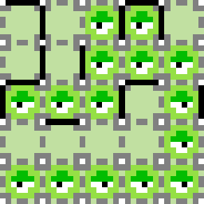

# Kutyagumi

A two-player game about cells and taking over the world!

## Where to play

The web version of the game is available to play [here](https://eutropius225.github.io/kutyagumi/index.html),
or on [itch.io](https://eutro.itch.io/kutyagumi) (v1.0.0).

If you have issues, see if your browser is compatible [on the first row of this table](https://developer.mozilla.org/en-US/docs/Web/API/WebGL2RenderingContext#Browser_compatibility).

A native Java version is available [here](https://github.com/eutropius225/kutyagumi/releases/tag/v1.0.0).

You can also [build it yourself](#building)!

## Online Multiplayer

#### Web

To host a game, add `?host=<game-id>` to the end of the URL.

To join a game, add `?join=<game-id>` to the end of the URL.

`<game-id>` can be anything that doesn't contain `?` or `&`.

For example, to play with a friend, pick a suitable game ID. `eutro`
will be used in this example.

1. Navigate to `https://eutropius225.github.io/kutyagumi/index.html?host=eutro`
2. Tell your friend to go to `https://eutropius225.github.io/kutyagumi/index.html?join=eutro`

To rematch, the host needs to refresh first, then the other party can do the same to join.

#### Jar

To host a game, run with the arguments `host <game-id>`.

To join a game, run with the arguments `join <game-id>`.

## How to play

### Overview

There are two colonies of cells (), red and green, 
fighting for territory.

Your objective is to seize more of the board than your opponent.

### Placement

Cells can be placed adjacent (up, down, left or right) to other cells of their colour, 
provided there is no wall () between them.

To place a cell, click a suitable place on the board when it is your turn.


_Note that the background colour reflects whose turn it is._

When an area can only be reached by one player, for example if it is closed off,
it will automatically be claimed by that player.



### Pieces

#### Cells

Cells are your pieces. Have more of them than your opponent to win.


_Running totals are shown in the top left and right corners:_

 

#### Walls

Walls are solid things that cannot be placed through.


#### Boosters

Boosters let you place again after you place a cell on them.


## Building

To build this project, you'll need the Clojure CLI tool:

https://clojure.org/guides/deps_and_cli


To develop in a browser with live code reloading:

```
clj -A:dev
```


To build a release version for the web:

```
clj -A:prod:play-cljc
```


To develop the native version:

```
clj -A:dev native

# NOTE: On Mac OS, you need to add the macos alias:

clj -A:dev:macos native
```


To build the native version as a jar file:

```
clj -A:prod uberjar
```
